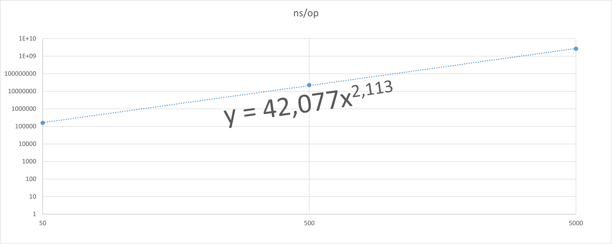
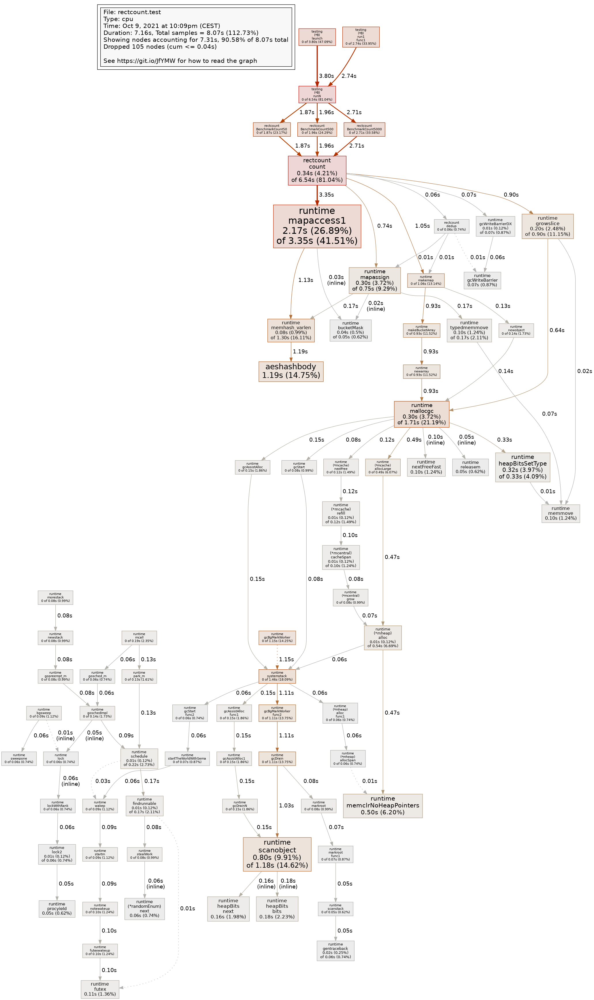

# rectcount
Count all (non-degenerated) rectangles that can be found from a set of interger coordiantes points.

# Problem statement

Given a set of (distinct) points of integer coordinates, find a time efficient algorithm to count the number of rectangles.

# Performance 

Currently estimated O(n^2) x ("mapAccess time") computation time.
Golang doc says that map access ( *runtime.mapaccess1* ) worst-case time could be as bad as O(n), 
which would lead to a total of O(n^3) as a worst case.

Benchmarks on random data points are showing slightly worst behaviour than O(n^2), around O(N^2.11..), far from the worst case of O(n^3).



go test -bench=. -benchmem

```
goos: linux
goarch: amd64
pkg: github.com/xavier268/rectcount
cpu: Intel(R) Core(TM) i7-10700 CPU @ 2.90GHz
BenchmarkCount50-8          9254            127181 ns/op          262860 B/op       1233 allocs/op
BenchmarkCount500-8           52          21023347 ns/op        31874901 B/op     124758 allocs/op
BenchmarkCount5000-8           1        2705828038 ns/op        2182755264 B/op 12497514 allocs/op
PASS
ok      github.com/xavier268/rectcount  5.572s
```

go test -bench=. -benchmem -benchtime=50x

```
goos: linux
goarch: amd64
pkg: github.com/xavier268/rectcount
cpu: Intel(R) Core(TM) i7-10700 CPU @ 2.90GHz
BenchmarkCount50-8            50            158989 ns/op          262880 B/op       1233 allocs/op
BenchmarkCount500-8           50          22512760 ns/op        31874904 B/op     124758 allocs/op
BenchmarkCount5000-8          50        2675774143 ns/op        2182754588 B/op 12497513 allocs/op
PASS
ok      github.com/xavier268/rectcount  137.787s
```

